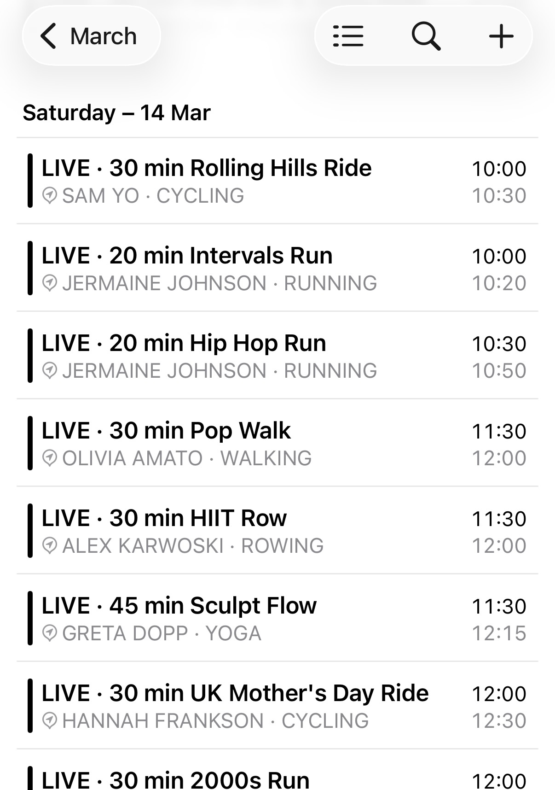
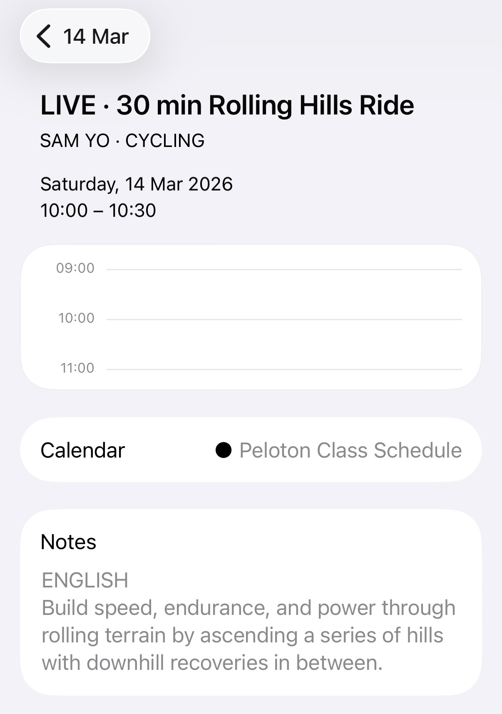

# peloclock

<p align="center">
  <picture>
    <source media="(prefers-color-scheme: dark)" srcset="assets/peloclock_dark.png">
    
  </picture>
</p>

A self-hosted Peloton class calendar that generates subscribable iCal feeds. Subscribe in Apple Calendar, Google Calendar, Outlook, or any iCal-compatible app and see upcoming Peloton live classes update automatically.

Built for Peloton members who want their live class schedule in their personal calendar without relying on third-party services.

You can see a live example at [peloclock.com](https://peloclock.com).

<p align="center">
&nbsp;
&nbsp; &nbsp;
&nbsp;
</p>

## Features

- Subscribable `.ics` feeds you can add to any calendar app
- Filter by instructor, class type (Live, Premiere, Encore), fitness discipline, duration, and language
- SQLite storage - no MySQL or external database required
- Browser-based setup wizard to get running quickly
- Automatic token management via [ultra-nick/peloton-auth](https://github.com/ultra-nick/peloton-auth) - no manual re-authentication

## Requirements

- PHP 8.0 or higher (with `ext-curl`, `ext-pdo`, `ext-pdo_sqlite`)
- Composer
- A web server (Apache, Nginx, or PHP's built-in server for local use)
- A Peloton account
- Ability to run a scheduled script (cron or launchd)

## Installation

**1. Clone the repository**

```bash
git clone https://github.com/ultra-nick/peloclock.git
cd peloclock
```

**2. Install dependencies**

```bash
composer install
```

**3. Point your web server at the `public/` directory**

The `public/` folder is the web root. Everything outside it - including your credentials, the database, and the calendar cache - is kept private.

A typical Nginx config:

```nginx
root /path/to/peloclock/public;
index index.php;
```

**4. Create the `calendars/` directory**

The sync script writes pre-generated `.ics` files here. It sits outside the web root.

```bash
mkdir -p calendars
chmod 755 calendars
```

**5. Run the setup wizard**

Visit `https://yourdomain.com/setup.php` in your browser and follow the prompts. Setup will ask for your Peloton username and password, create the SQLite database, and run an initial sync.

> Once setup is complete, delete or restrict access to `setup.php`. It is not needed after installation.

## Directory structure

```
peloclock/
├── calendars/          # Pre-generated .ics files (outside web root)
├── public/             # Web root
│   ├── index.php       # Calendar feed endpoint
│   └── setup.php       # Browser-based installer
├── src/
│   └── sync.php        # Scheduled sync script - fetches classes and regenerates feeds
├── vendor/             # Composer dependencies (not committed)
├── composer.json
└── config.php          # Created by setup wizard (not committed)
```

## Scheduling the sync

`src/sync.php` fetches the latest class schedule from Peloton and regenerates the calendar feeds. Run it every few hours via cron or launchd.

**cron** (every 6 hours):

```cron
0 */6 * * * /usr/bin/php /path/to/peloclock/src/sync.php
```

**launchd** (macOS) - create a `.plist` in `~/Library/LaunchAgents/`:

```xml
<?xml version="1.0" encoding="UTF-8"?>
<!DOCTYPE plist PUBLIC "-//Apple//DTD PLIST 1.0//EN"
  "http://www.apple.com/DTDs/PropertyList-1.0.dtd">
<plist version="1.0">
<dict>
  <key>Label</key><string>com.peloclock.sync</string>
  <key>ProgramArguments</key>
  <array>
    <string>/usr/bin/php</string>
    <string>/path/to/peloclock/src/sync.php</string>
  </array>
  <key>StartCalendarInterval</key>
  <array>
    <dict><key>Hour</key><integer>0</integer><key>Minute</key><integer>0</integer></dict>
    <dict><key>Hour</key><integer>6</integer><key>Minute</key><integer>0</integer></dict>
    <dict><key>Hour</key><integer>12</integer><key>Minute</key><integer>0</integer></dict>
    <dict><key>Hour</key><integer>18</integer><key>Minute</key><integer>0</integer></dict>
  </array>
  <key>RunAtLoad</key><true/>
</dict>
</plist>
```

Load it with:

```bash
launchctl load ~/Library/LaunchAgents/com.peloclock.sync.plist
```

## Subscribing to a calendar

Once the sync has run, calendar feed URLs are available via `public/index.php`. Add a feed URL in your calendar app under "New calendar subscription" or equivalent.

Feeds refresh according to your calendar app's subscription interval. Most apps check every few hours by default.

## Authentication

peloclock uses [ultra-nick/peloton-auth](https://github.com/ultra-nick/peloton-auth) for token management. The library handles the full OAuth 2.0 PKCE flow automatically - initial login, token refresh, and silent re-authentication if a refresh token ever expires. You should never need to re-enter your credentials after setup.

Tokens are stored outside the web root and rotated on every refresh.

## Security notes

- Keep `config.php` and the SQLite database outside the web root (this is the default layout)
- Delete or restrict `setup.php` after installation
- If self-hosting on a public server, consider adding HTTP authentication to restrict calendar feed access

## License

MIT - see [LICENSE](LICENSE)
